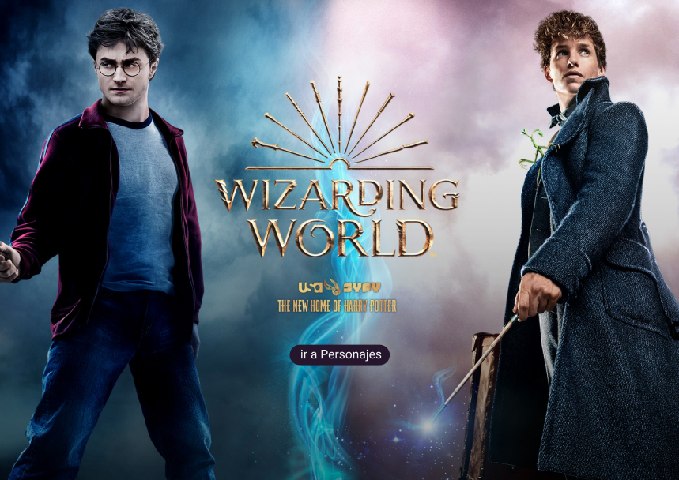
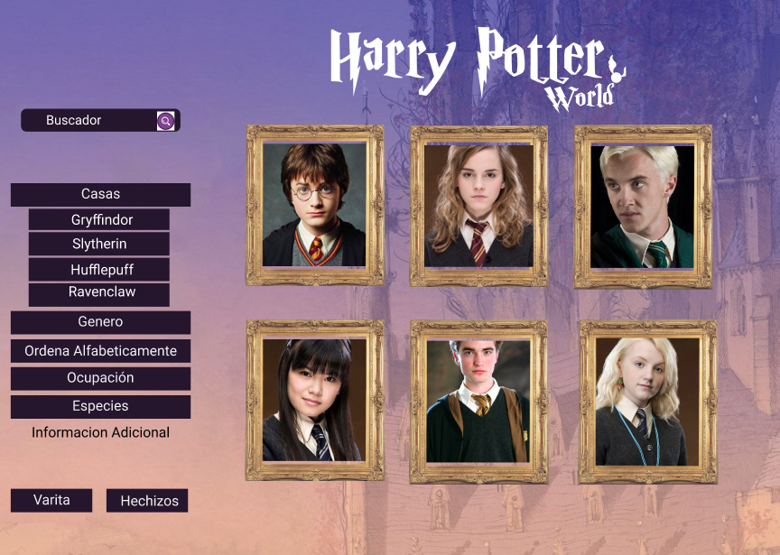
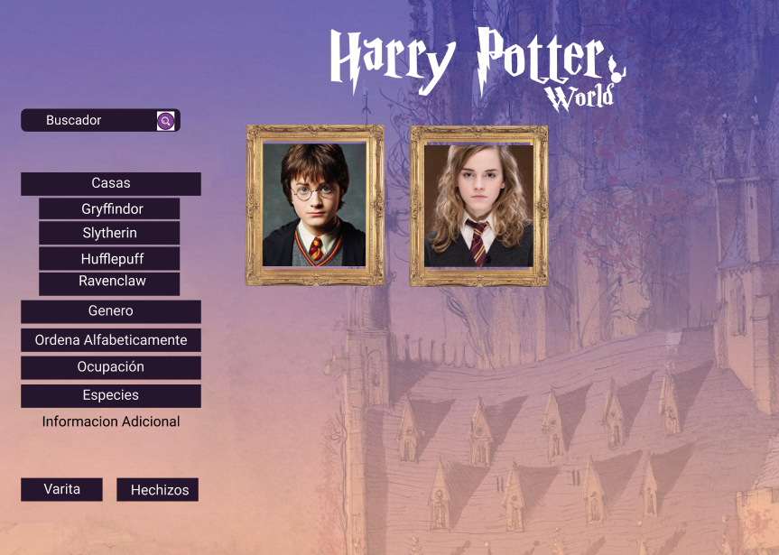
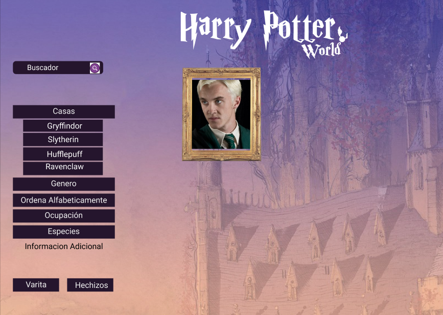
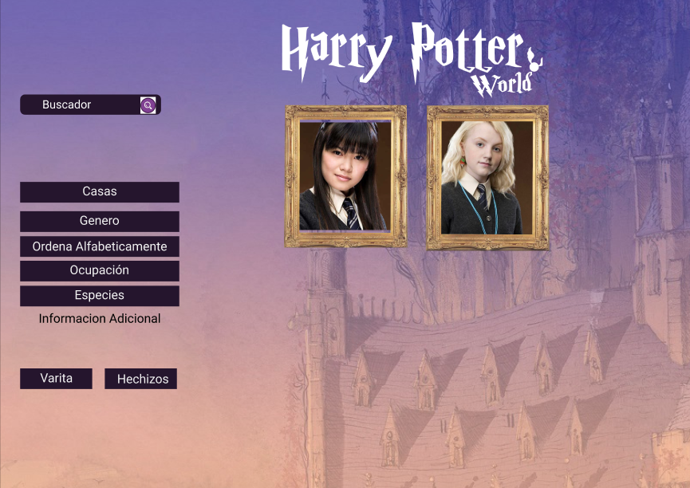

:dizzy:Wizards Unite: Harry Potter:dizzy:
 
## Índice

[1. Definición de producto](#intro)
[2. Historias de Usuarios](#historias)
[3. Diseño de interfaz del usuario](#diseño)
[4. Organización del trabajo](#organizacion)

***

<a id="intro"> :star:Definición de producto:¿Que es Wizards Unite: Harry Potter?:star:<a>

Wizards Unite:Harry Potter es una página web dirigida a jugadores novatos que quieren incursionar en la de saga Harry Potter. Dentro de esta página el usuario podrá conocer,  cada personaje con sus características e información del actor que le dio vida de cada personaje.

Para ser el uso efectivo de esta herramienta el usuario deberá ingresar a la página web donde conseguirá un mensaje de bienvenida y podrá acceder a los personajes de esta historia por medio de un click. Una vez ingrese el usuario podrá visualizar todos los personajes  de la saga con fotos referenciales e información de cada uno.

El objetivo principal de esta página es facilitar la búsqueda a través de filtros donde el usuario podrá elegir  características específicas como: casa, especie,  género, ocupación que lo ayudara a conocer más de la  historia del mundo mágico llenos de hechizos. A demás de ello el usuario tendrá la opción de ordenar los personajes alfabéticamente de la A-z y viceversa.

**¿Quiénes son los principales usuarios del producto?**
Personas que quieran incursionar en el juego wizards Unite: Harry Potter y no tengan mucho conocimiento previo respecto a todas las caracteristicas de los perdonajes de la saga.

**¿Como crees que el producto que estas creando resuelve el problema del usuario?**
El usuario que quiera incursionar podra encontrar las caracteristicas de cada personaje y podra filtrar diferentes parametros para que al momento de juegar el personaje escogido cumpla con las caracteristicas que el busca.

***

<a id ="historias"> :star: Historias de usuarios :star: <a>

1. **Historia de usuario:**
Como: Usuario. Quiero: ingresar en buscador de personajes. Para: Ver datos de personas
Criterios de aceptación
Dado: se encuentra en la página web. Cuando: el usuario leer la descripción de la página. Entonces: Se muestra página de bienvenida con descripción de la página
Terminado: 
Se muestra página de inicio.
2.  **Historia de usuario:**
Como: Jugador Novato. Quiero: Visualizar  todos los personajes de Harry Potter. Para: Conocer características de cada personaje.
Criterios de aceptación
Dado: El usuario está en la página web. Cuando: se carga la página. Entonces: se le muestra todas las tarjetas con las características de cada personaje.
Terminado: 
El usuario puede leer las características de cada personaje.
3.  **Historia de usuario:** 
Como: Jugador. Quiero: ordenar la página principal por orden alfabético. Para: que en una vista rápida pueda identificar que personajes están disponibles en las opciones.
Criterios de aceptación 
Dado: Que el usuario puede desea organizar las cartas alfabéticamente. Cuando: Cuando da click en el botón Ordenar. Entonces: las cartas se organizan alfabéticamente.
Terminado: 
Mostrar cartas ordenadas.
4.  **Historia de usuario:**
Como: Jugador. Quiero: Clasificar personajes por características específicas (Casa, Género, Rol, Especie, Ascendencia). Para: Obtener Información puntual de personajes.
Criterios de aceptación
Dado: dado que el usuario selecciona una característica específica (Casa, Género...) Cuando: la página se carga. Entonces: Muestra los personas que estén dentro de las características solicitadas
Terminado: 
La página muestra personajes que contenga datos solicitados.
5.  **Historia de usuario:**
Como: Jugador. Quiero: Ubicar Personaje por nombre. Para: obtener información general de ese personaje.
Criterios de aceptación
Dado: El usuario escribió el nombre del personaje. Cuando: Cuando de click en buscar Entonces: Muestra la imagen del personaje y características. 
Terminado: 
Mostrar información de personaje
6. **Historia de usuario:**
Como: Jugador. Quiero: Obtener información de tipo de varita de cada personaje. Para: Obtener información de Wood, Care y  length.
Criterios de aceptación
Dado: El usuario con un click. Cuando: mientras carga la página. Entonces: Muestra el personaje y las características de varita mágica.
Terminado: 
Muestra en la página personas y características de su varita mágica.   
7.  **Historia de usuario:**
Como: Jugador. Quiero: Obtener información de los hechizos de cada mago. Para: elegir cuál de todos los personajes es más poderoso.
Criterios de aceptación
Dado: El usuario da un click al botón de hechizos. Cuando: carga la página. Entonces: Muestra el personaje y sus hechizos
Terminado: 
Muestra en la página personajes y sus hechizos.  
8.  **Historia de usuario:**
Como: Jugador. Quiero: Volver a la página principal sin ningún filtro. Para: volver a elegir nuevos filtros con distintas características y poder optar a otro personaje.
Criterios de aceptación
Dado: El usuario de click al botón de volver a la página de inicio. Cuando: Se carga la página. Entonces: Vuelve a la página principal donde se muestran las cartas de todos los personajes.
Terminado: Mostrar la página de inicio.

***

<a id="diseño"> :star: Diseño de interfaz del usuario :star: <a>

 **Acá nuestro prototipo de baja en papel**

  **Prototipo de alta Fidelidad**
[Acá puedes ver nuestro prototipo de alta](https://www.figma.com/file/QSCp5wZF1agIjs9de9Hkiz/Prototipo-Final-Harry?node-id=1%3A6)

**Resumen del feedback recibido indicando las mejoras a realizar**
 
  Al mostrar el prototipo de alta fidelidad los usuarios nos indicaron que los colores no eran atractivos, por lo que tomamos la decisión de mantene la estructura y el concepto de la pagina e ir cambiando el fondo y los colores de la intervaz durante el desarrollo del codigo para asi lograr que fuese atractivo para los usuarios.  

  Al mostrar del desarrollo del codigo los usuarios indicaron que la pagina Web era facil de enteder, es intuitivo.

    **Imagen final del Proyecto**

***

<a id="organizacion"> :star: Organización del trabajo :star: <a>

  Este proyecto lo organizamos por medio de la herramineta Trello, establecimos las actividades a realizar en el proyecto tomando en cuenta las Historias de usuarios.

  **Imagen de Trello** 
  
